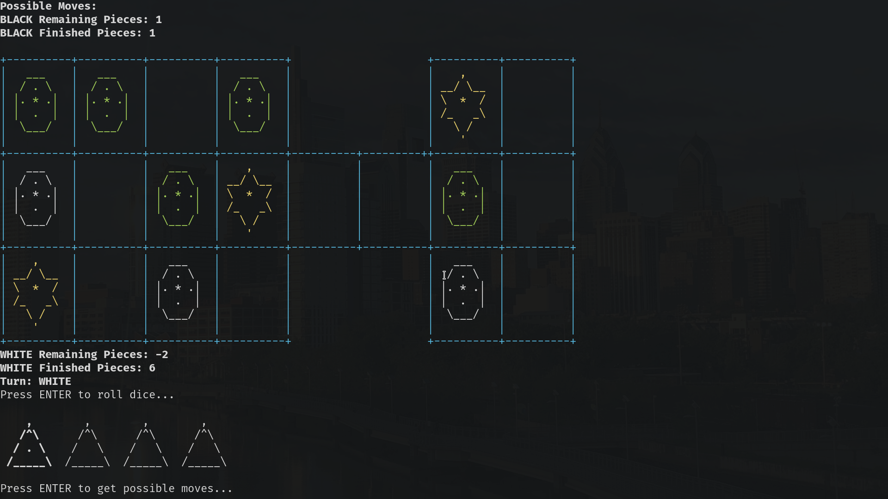

# Introduction
The Royal Game of Ur is the world's oldest board game discovered in Ancient Mesopotamia by Dr. Irving Finkel. It's a simple race game, similar to Ludo or Backgammon. I chose this because while the rules of the game are relatively simple, there are several nuances, especially in the displaying the game to the terminal, and certain aspects, like the path that the pieces follow, are particularly well modelled by certain data structures.

The development took about one week. Altogether, the code is 970 lines, comprised of 322 lines of C header files and 648 lines of C++ code. These make up 8 separate classes. 

The code can be found on Github [https://github.com/ritobanrc/Project1](https://github.com/ritobanrc/Project1).

# Approach to Development
I approached the development of this project modularly. First, I developed several utility classes, like `Display` and `SideData`. Then, I went through each game feature. I independently developed the board, and then the dice, and I slowly added functionality one step at a time, testing along the way. First I added the pieces and piece display code, and then I allowed the pieces to move, and then be captured, and then win logic, etc.

Throughout this, I tried to commit the code to Github often, ideally after each feature was developed, so I could easily roll back if something broke, or make a branch to work on a different feature for some time.

# Game Rules

The game is a race game, with rules similar to Ludo or 
Parcheesi. Each player has 7 pieces, which they must get
through the entire board. Each turn, the player rolls the
4 tetrahedral dice, each with two marks at two corners.  
You move forward based on the number of marks. The first
player to get all of their pieces off the board wins.
However, if you land on one of your opponent's pieces, you 
"capture" that piece and it gets sent back.
Additionally, the star squares let you roll a second time when
you land on them, and the central star square is a safe space,
where you can't be captured.

# Description of Code
The code is organized into several classes, each with distinct roles.

* Game
    - The majority of the game logic. Anything to do with moves is here, as well as things about the overall game state, like whose turn it is. It also contains the Board and the DiceRoller.
* Board
    - Contains a 2D array representing the board, as well as methods to show the board and associated data to help with showing the board.
* DiceRoller
    - Contains a bitset to represent the 4 dice, as well as methods to actually roll the dice and show the dice.
* Piece
    - Represents a piece on the board. The path taken by the piece is modelled by an iterator over a linked list.
* Square
    - Represents a square, as well as what Piece is on it. The most important function is `GetDisplayCharAt`, which is what the Board uses to figure out how to display the square.   
* Display
    - A static class that contains several methods to help with displaying things with formatting
* Color
    - Provides a nice interface for dealing with ANSI color values.
* SideData
    - Represents a piece of data that exists for both sides (white and black), as well as a function to get a reference to one of them.

# Sample




# Checkoff Sheet
1. Container Classes
    * Sequences
        - `std::list<Square*>` is used to represent the path that is taken by the pieces through the Board.
        - `std::bitset<4>` is used to represent the 4 dice in the DiceRoller. 
    * Associative Containers
        - `std::set<Piece*>` is used for the set of all the pieces currently on the board.
        - `std::map<std::string, Color>` is used as a map from strings to colors, so we can use the string "Red" to easily get the corresponding ANSI color value.
    * Container Adapters
        - `std::deque<Move>` is used to hold all the possible moves. Moves are added in to the queue, and then they can be popped off and dealt with one at a time.
2. Iterators
    * `std::list<Square*>::const_iterator` is used to represent the location of pieces. The piece location is a pointer into the path list, and can be incremented to move forward.
    * Game.cpp:107 -- A random access iterator into the `deque` is used to go over all of the moves.
    * Game.cpp:165 -- A bidirectional iterator into the `std::set<Piece>` is used to go over all of the pieces
    * Board.cpp:96 -- A constant Random Access Iterator over the rows of the array is used.
    * Board.cpp:97 -- And another constant Random Access Iterator over the columns of the 2D array.
3. Algorithms
    * Game.cpp:107 -- `std::for_each` is used to iterate over the possible moves
    * DiceRoller.h:28 -- `std::bitset<4>::count` is used to count the number of bits in the bitset.
    * Game.cpp:256 -- `std::set::erase` is used to remove from the set.
    * Game.cpp:105 -- `std::sort` is used to sort the moves by column, so they can be easily selected by the user.

# Documentation

The majority of the game logic is in `Game::PlayGame`.

Pseudocode:

* Game::PlayGame
    - Display Basic information
    - Display Board
    - If _turn_ is _white_
        * Print "WHITE"
    - Else
        * Print "BLACK"
    - Wait for ENTER to roll Dice
    - Roll Dice
    - If _dice_ equals 0
        - Print "Better luck next time"
        - Call NextTurn to switch _turn_
        - Return to beginning
    - If not against computer, or _turn_ is white (not computer)
        - Wait for ENTER to get possible moves
    - Get Possible Moves
    - If there are no possible moves
        - Print "No possible moves"
        - Call NextTurn to switch _turn_
        - Return to beginning
    - Sort moves according to X position
    - Assign each move a number
    - If not against computer, or _turn_ is white (not computer)
        - Display possible moves
        - Ask user for move selection
    - Else
        - Select Move Randomly
    - Apply Move
    - Clear the Possible Moves
    - If move landed on star
        - Print "You landed on a star."
        - Return to beginning _without_ calling NextTurn. 
    - Check for Win
    - Call Next Turn
    - Return to Beginning


# Code

## main.cpp
```{include=main.cpp}
```

## Game.h
```{include=Game.h}
```

## Game.cpp
```{include=Game.cpp}
```

## Board.h
```{include=Board.h}
```

## Board.cpp
```{include=Board.cpp}
```

## Piece.h
```{include=Piece.h}
```

## Piece.cpp
```{include=Piece.cpp}
```

## Square.h
```{include=Square.h}
```

## Square.cpp
```{include=Square.cpp}
```

## DiceRoller.h
```{include=DiceRoller.h}
```

## DiceRoller.cpp
```{include=DiceRoller.cpp}
```

## Display.h
```{include=Display.h}
```

## SideData.h
```{include=SideData.h}
```

## Color.h
```{include=Color.h}
```

## Color.cpp
```{include=Color.cpp}
```
